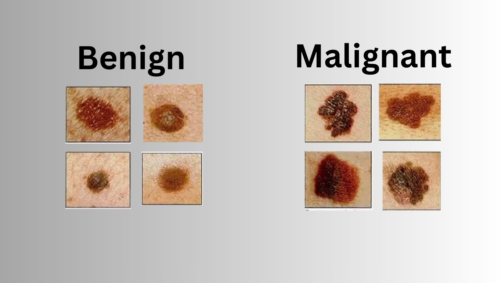

# Breast Cancer Tumor Cell Type Detection

## Overview
This repository contains a comparison of Random Forest (RF) and K-Nearest Neighbors (KNN) models for breast cancer tumor cell type detection. The project aims to demonstrate the performance of these two machine learning algorithms in classifying breast masses as malignant or benign.

## Dataset
The dataset used for this analysis includes fine needle aspirate biopsy data of breast masses, with features related to cell nuclei properties. The dataset consists of 569 instances categorized as malignant (cancerous) or benign (non-cancerous). It comprises 30 features, including mean, standard error, and worst values of ten nuclear parameters.

### Feature Attributes
- Radius
- Texture
- Perimeter
- Area
- Smoothness
- Compactness
- Concavity
- Concave Points
- Symmetry
- Fractal Dimension

## Analysis
The project includes the following key steps:
1. Data Pre-processing and Cleaning
2. Exploratory Data Analysis
3. Model Building and Evaluation
    - Random Forest Model
    - K-Nearest Neighbors Model
4. Comparison of Model Performance

## Results
Here are the key findings from the analysis:

### Accuracy Comparison:

**Random Forest (RF) Model:**
- 80-20 Split: Accuracy of approximately 97.39%
- 20-80 Split: Accuracy of around 93.20%

**K-Nearest Neighbors (KNN) Model:**
- 80-20 Split: Accuracy of approximately 98.26%
- 20-80 Split: Accuracy of around 95.39%

### Conclusion:

1. **Accuracy:** KNN outperforms RF in terms of accuracy, with both models maintaining accuracy above 90%, even with a 20-80 split.

2. **Train-Test Split Impact:** KNN is more robust to variations in training dataset size compared to RF.

3. **Runtime:** KNN has lower computation cost compared to RF.

## Repository Contents
- Jupyter Notebook (`breast_cancer_detection.ipynb`): Contains the complete analysis, code, and visualizations.
- `cell_image.jpg`: An image related to breast cancer cells.
- `brcaw.csv`: The dataset used for analysis.
- `README.md` (this file): Project overview and results.

## Usage
You can clone this repository to your local machine and run the Jupyter Notebook (`breast_cancer_detection.ipynb`) to reproduce the analysis. Ensure you have the required libraries installed.

## Credits
This project was created by Manish Joshi.

## License
This project is licensed under the MIT License. See the [LICENSE](LICENSE) file for details.
